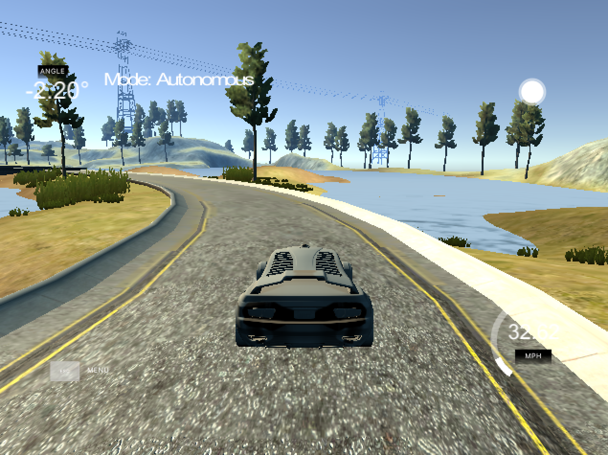
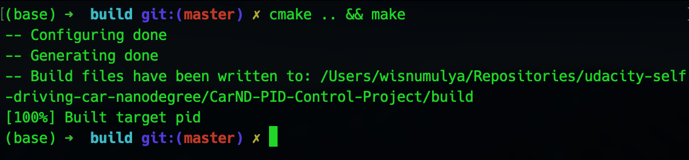

# PID Controller Project #

## Compilation ##

### 1. Your code should compile. ###

As the image above shows, the code compiles successfully.

## Implementation ##

### 1. The PID procedure follows what was taught in the lessons. ###

The code follows what taught in the classroom and the PID implementation can
mainly be seen under the `PID.cpp` file, where there is an update of P, I,
and D error under the `PID::UpdateError()` method and the calculation of the
controlled value (steering) under the `PID::TotalError()` method.

## Reflection ##

### 1. Describe the effect each of the P, I, D components had in your implementation. ###

The P component would affect how the steering would match the error between
the target path and the current position of the car: the P component would
ensure that the car would drive around the target path. The downside of it
is that it would make the car oscilates within a range of the target path,
and it is likely that the oscilation is too great to be within an acceptable
range. Here is an example of a P only component implementation on the code:

The D component would buffer the oscilation generated from the P component,
since it control by the difference between the current and the last error
of the car position with its target path: the smaller the difference, the
less steering is needed, and thus, a smoother control (less oscilation).
The downside of a D component alongside of the P component is that both of
them would not solve the problem of steering/wheel drift (a bias in the 
control). Here is an example of an addition of a D component to the P on
the code:

The I component would in turn solve the problem of bias, where the P and D
components would not. This is done by take into account the total error so
far to the steer control: if there is a bias, the total error would
increase greatly over time and the I component would thus be helpful in
take the bias into account. Since the simulation is perfect and has no bias,
the code does not implement it.

### 2. Describe how the final hyperparameters were chosen. ###

The whole hyperparameters tuning in this project is done manually.

The first thing to tune is the Kp coefficient, where I need to find one that
is low enough as to not produce big oscilation, but not too low as to not 
weaken the ability of the controller to steer the car on its trajectory path.
The Kp I found to be good enough as to minimize the oscilation on a straight
lane in the beginning, even though it starts getting out of hand when speed
increases and if there is a turning, is `0.2`.

The second thing to tune is the Kd coefficient, where I need to find one that
is big enough to buffer the oscilation by the Kp coefficient. I kept increasing
the Kd coefficient from `0.2` until I got the one that hampers the oscilation
sufficiently. The Kd I found to be large enough to buffer the oscilation
is `3.0`.

As to the Ki coefficient, I did not do any tuning and thus, set it to `0.0`.
This is because Ki coefficient is used to buffer the effect of a bias in the
thing we would like to control, it is steering/wheel drift in this case.
Whereas the simulation has no bias, so there is no steering/wheel drift, and
thus, no need to set the Ki to anything.

## Simulation ##

### 1. The vehicle must successfully drive a lap around the track. ###

Under my local machine, the vehicle has successfully driven a lap around the
track in the simulation.
